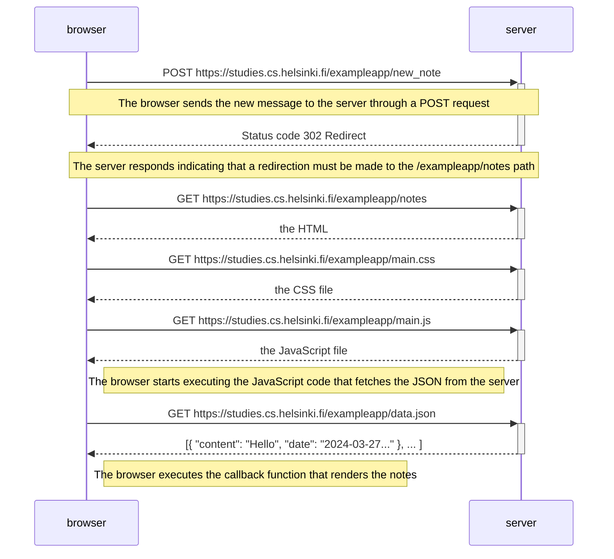

# Exercise 0.4: New note diagram

Create a diagram that describes the situation where the user creates a new note on the page https://studies.cs.helsinki.fi/exampleapp/notes by typing something in the text field and clicking the Save button.

If necessary, display the operations in the browser or on the server as comments on the diagram.

The diagram does not have to be a sequence diagram. Any sensible way to present events is fine.

All the information needed to do this, and the next two exercises, can be found in the text of [this part](https://fullstackopen.com/es/part0/fundamentos_de_las_aplicaciones_web#formularios-y-http-post). The idea of these exercises is to read the text one more time and think about what is happening there. It is not necessary to read the application [code](https://github.com/mluukkai/example_app) but of course it is possible.

You can create the diagrams with any program, but perhaps the best and easiest way to make diagrams is using the Mermaid syntax which is now implemented in GitHub Markdown Pages.

## Result:

